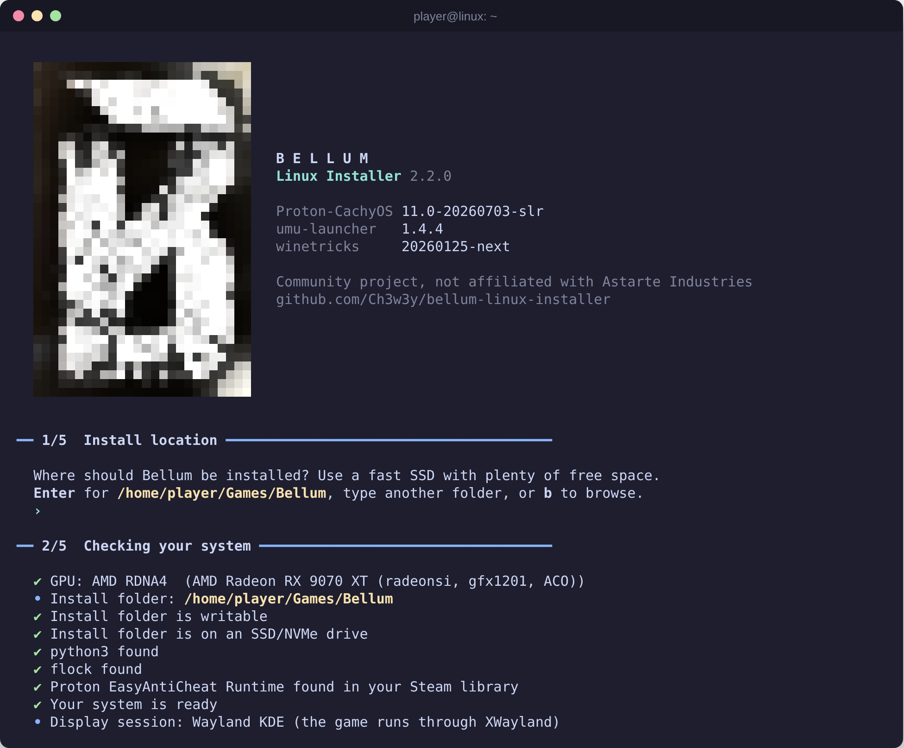
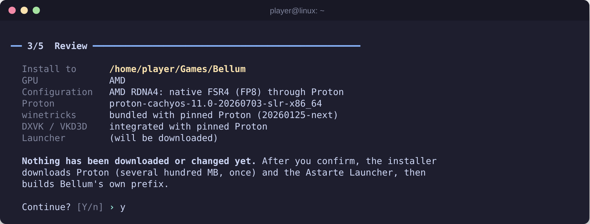
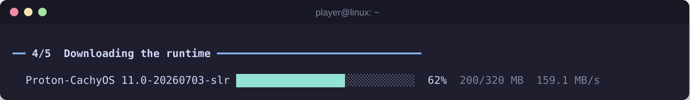
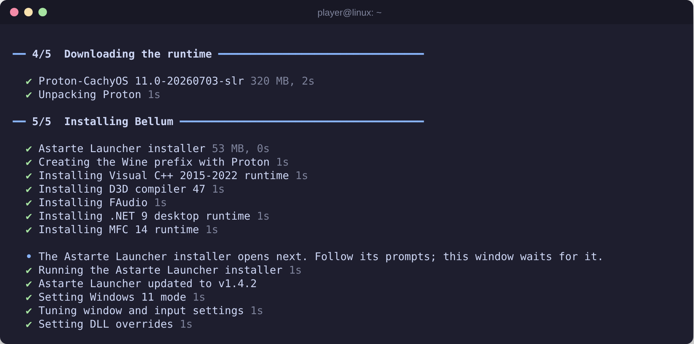
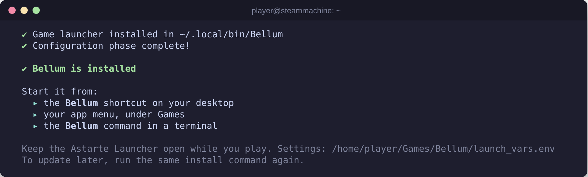

# Bellum Linux Installer

Play **Bellum** on Linux with one command. The installer sets Bellum up in its
own Proton prefix with a pinned, verified Proton build, Valve's Proton
EasyAntiCheat Runtime and the official Astarte Launcher, then adds a desktop
shortcut, an app-menu entry and a `Bellum` command.

> **Community project.** This is not official support and is not affiliated
> with Astarte Industries. Bellum, the Astarte Launcher and their logos belong
> to Astarte Industries. The goal is simple: nobody who has moved to Linux
> should have to boot Windows to play Bellum.

This project continues [Joheb Rahman (joepaji)'s original Bellum Linux
Installer](https://github.com/joepaji/bellum-linux-installer). See
[Credits](docs/credits.md) for the project's lineage and the third-party software it
relies on.



**Tested on:** AMD RX 9070 XT (RDNA4) · CachyOS · KDE Plasma Wayland, with an
Easy Anti-Cheat online session ([release evidence](docs/release-evidence/)).
The installer recognises the machine it runs on (Steam Deck, Steam Machine,
SteamOS, Bazzite, each AMD generation and NVIDIA on each major distro) and
picks the matching settings by itself; see [Platforms](#platforms). Profiles
other than RDNA4 are **expected** to work but aren't verified yet, and reports
from other setups are very welcome.

## Install

You need **Steam** installed and signed in; see [Before you
start](#before-you-start). Then open a terminal and paste:

```bash
curl -fsSL https://raw.githubusercontent.com/Ch3w3y/bellum-linux-installer/main/install.sh | bash
```

It works in any shell, fish included, and installs the latest release. Press
**Enter** at each question to accept the defaults. To pass options, put them
after `bash -s --`. For example, to install a specific release or release
candidate:

```bash
curl -fsSL https://raw.githubusercontent.com/Ch3w3y/bellum-linux-installer/main/install.sh | bash -s -- --version v2.3.0
```

Prefer not to pipe a script into your shell? See [Verify before you
run](#verify-before-you-run).

### What happens

1. **Download and verify.** `install.sh` downloads the release from this
   repository's [Releases](https://github.com/Ch3w3y/bellum-linux-installer/releases),
   checks it against the release's `SHA256SUMS`, and unpacks it to
   `~/.local/share/bellum-installer/<version>`. If `python3` 3.10+ or `flock`
   is missing, it asks once before installing it with your package manager
   (`pacman`, `dnf`, `apt` or `zypper`). It never runs as root.
2. **Install location.** Press Enter for `~/Games/Bellum`, type another folder,
   or type `b` for a folder picker. Use a fast SSD with plenty of free space.
3. **System check.** The installer detects your platform (hardware, distro,
   GPU generation, driver and display session) and checks for the tools, disk
   space and the Proton EasyAntiCheat Runtime. If the runtime is missing, it
   offers to ask Steam to install it and waits. Every problem is reported at
   once, with the command that fixes it; NVIDIA driver problems are warnings
   with the fix for your distro.
4. **Review.** One summary of what will be installed, including the detected
   profile, for example `Steam Deck OLED · SteamOS 3 · RDNA2 · Game Mode`.
   **Nothing is downloaded or changed before you confirm.**

   

5. **Runtime.** It downloads Proton-CachyOS and umu-launcher once, checks their
   SHA-256 pins, and stores them under `~/.local/share/bellum/`.

   

6. **Install.** It creates the prefix, installs the Windows runtimes Bellum
   needs (Visual C++, .NET 9 and others) through Proton, and opens the Astarte
   Launcher installer; follow its prompts. It then updates the launcher to its
   latest signed release and writes the launch settings and shortcuts.

   

7. **Done.** Start Bellum from the desktop shortcut, your app menu or the
   `Bellum` command. On a Steam Deck, Steam Machine, SteamOS or Bazzite's
   Deck images it offers (default No) to add Bellum to Steam for Game Mode;
   see [Steam Deck, Game Mode and controllers](#steam-deck-game-mode-and-controllers).

   

If the install fails, it removes the folder it created and tells you what to
do and where the full log is. If it was interrupted, run the same command
again: it recognises the unfinished install and offers to start over.

<sub>Screenshots are rendered from the installer's own terminal UI code by
`tools/screenshots`, replaying a real install on an RX 9070 XT (CachyOS, KDE
Wayland) with shortened timings.</sub>

## Before you start

- An **x86_64** PC with a Vulkan-capable GPU and an up-to-date driver (Mesa for
  AMD and Intel, the proprietary driver for NVIDIA).
- An **SSD or NVMe** drive for the install. Astarte strongly recommends it, and
  the installer warns you otherwise.
- **Steam**, installed and signed in, for the free **Proton EasyAntiCheat
  Runtime** (Steam app 1826330). The installer offers to ask Steam for it. To
  install it yourself: in Steam open **Library → Tools**, find **Proton
  EasyAntiCheat Runtime** and install it, or open `steam://install/1826330`.
  Native, Flatpak and Snap Steam and every Steam library folder are supported. Steam
  keeps it up to date. If yours is somewhere unusual, set
  `PROTON_EAC_RUNTIME="/path/to/Proton EasyAntiCheat Runtime"` before
  installing.

Everything else is provided: Proton, umu-launcher and winetricks are
downloaded and verified by the installer, and the launcher's signature is
checked in-process. You don't need Wine, winetricks, umu-launcher,
`osslsigncode` or `wget` on your system.

| Host tool | Why | Needed |
| --- | --- | --- |
| `python3` 3.10+ | runs the pinned umu-launcher | yes; preinstalled almost everywhere, SteamOS and Bazzite included |
| `flock` (util-linux) | stops a second launch while Bellum is running | yes; part of every standard install |
| `glxinfo` | better GPU detection | optional |
| `zenity` or `kdialog` | the folder picker (`b`) | optional |

## Playing

Launch Bellum from:

- the **Bellum** desktop shortcut (if you have a `~/Desktop` folder),
- **Applications → Games → Bellum**,
- the `Bellum` command in a terminal. It lives in `~/.local/bin`; if your shell
  can't find it, the installer prints the line that adds it to your `PATH`.

The Astarte Launcher must stay open while you play, because it authenticates
the game. Clicking the shortcut again while Bellum is running does nothing.

**Launcher updates.** Each time you start Bellum, the shortcut checks
Astarte's release list and, if there's a newer launcher, downloads it and
installs it only if it is signed by `ASTARTE INDUSTRIES INC.`. The launcher
can't replace itself under Wine (it would loop, updating and restarting), so
Bellum does it before the launcher starts. If the check fails, for example
when you're offline, the installed launcher starts as usual.

**Optional extras.** These are off because none has been validated with Easy
Anti-Cheat. To try one, set it to `1` in `<install folder>/launch_vars.env`:

```bash
export BELLUM_MANGOHUD=1   # performance overlay (needs mangohud)
export BELLUM_GAMEMODE=1   # Feral GameMode while playing (needs gamemode)
export BELLUM_GAMESCOPE=1  # run inside gamescope (needs gamescope)
export BELLUM_VKBASALT=1   # vkBasalt post-processing (needs vkbasalt)
```

**Logs.** The launcher, game and launcher updates log to
`<install folder>/launcher.log`. The installer logs to
`~/.local/share/bellum-installer/<version>/logs/installer.log`, and every error
message ends with that path.

## Updating

Run the install command again. On a finished install it offers an update
instead of a reinstall: it downloads the current Proton and umu-launcher pins,
rewrites the shortcut and `launch_vars.env`, and updates the Astarte Launcher.
Your game files, launcher login and saves are kept.

This project's CI checks for new Proton-CachyOS and umu-launcher releases every
day and proposes a pin update once a release passes its checks (see [runtime
pins](docs/runtime-pins.md#automated-pin-updates)), so updating now and then
picks up upstream performance and stability fixes.

## Graphics and performance

There is one configuration, the most stable one and then the fastest that
stays stable, chosen for your GPU. There are no presets to pick.

- **AMD RDNA4 (RX 9000):** native FSR4 (FP8). The installer sets
  `PROTON_FSR4_UPGRADE=1`, so Proton offers FSR4 to D3D12 games that use AMD's
  FidelityFX API (FSR 3.1 or later).
- **AMD RDNA3 (RX 7000, Steam Machine):** Proton's automatic FSR4 check, plus
  `DXIL_SPIRV_CONFIG=wmma_rdna3_workaround` as in v2.2. Whether the
  workaround is a net gain is still to be measured.
- **AMD RDNA2 (RX 6000, Steam Deck), older and unrecognised AMD GPUs:** no
  FSR4 emulation path. These GPUs lack the matrix instructions the RDNA3
  workaround targets, so FSR4 through FP16 emulation is expected to cost more
  than it gains; the game uses its own FSR 3.x.
- **NVIDIA:** DLSS through Proton's defaults (NVAPI on, `nvngx.dll` from your
  driver). RTX and GTX 16-series cards also get `PROTON_NVIDIA_LIBS=1` (CUDA,
  NVENC and OptiX bridges). Proton's DLSS DLL auto-download stays off.
  vkd3d-proton's descriptor heap is off on NVIDIA (`VKD3D_CONFIG=""`): with
  driver 610.57.04 on an RTX 5070 Ti it caused a GPU crash
  (`DXGI_ERROR_DEVICE_REMOVED`) about a minute into play, and play was stable
  without it. If it fixed a problem for you before, set
  `VKD3D_CONFIG="descriptor_heap"` in `launch_vars.env`; an update rewrites
  that file, so set it again afterwards. AMD and other GPUs keep it on.
- **Intel and unrecognised GPUs:** standard Proton settings.
- **Display server:** the same on X11, Wayland and gamescope; the game runs
  through XWayland. Proton enables fsync by itself where the kernel supports
  it.

Set `PROTON_FSR4_INDICATOR=1` in `launch_vars.env` to show an on-screen FSR
watermark. [How the pinned Proton handles upscalers](docs/runtime-pins.md#upscaler-behaviour-of-the-pinned-proton).

**The installer never adds, copies or replaces DLLs** in the game or the
prefix; upscalers come only from Proton's built-in features. Don't place
proxy DLLs in the game folder yourself either (ReShade, OptiScaler and
similar `dxgi.dll`/`d3d11.dll` files): anything there loads into the process
Easy Anti-Cheat protects.

**NVIDIA drivers.** The system check warns, with the exact fix for your
distribution, when:

- the open-source nouveau/NVK driver is in use (no DLSS or NVAPI; Easy
  Anti-Cheat is untested on it);
- the driver is older than **575.51.02**, the minimum for the DXVK 3.x in the
  pinned Proton;
- `nvidia-drm.modeset` is off on a Wayland session;
- NVIDIA's Vulkan driver (`nvidia_icd.json`) is missing;
- an RTX 50-series card runs a 595-branch driver. Some have community-reported
  Proton regressions, for example 595.71.05 failing Vulkan swapchain creation
  where 595.58.03 worked
  ([NVIDIA forum](https://forums.developer.nvidia.com/t/regression-595-71-05-blackwell-rtx-5070-vulkan-swapchain-creation-fails-vk-error-initialization-failed-under-proton-worked-on-595-58-03/371778),
  [CachyOS #378](https://github.com/CachyOS/distribution/issues/378)). If you
  get shader-loading failures or a black screen, try 595.58.03 or the 590
  branch.

These are warnings; the install continues. This project hasn't validated any
NVIDIA driver branch yet.

## Platforms

The installer detects the platform, it never asks you to choose: OS family ×
hardware × GPU generation × session. The review screen shows what it found and
whether that profile is **verified** (tested on real hardware with an Easy
Anti-Cheat online session) or **expected** (derived from the code and
specifications, not yet tested). You can still override any setting in
`launch_vars.env`.

| Profile | Launch settings | Status |
| --- | --- | --- |
| AMD RDNA4 (RX 9000) | native FSR4 (`PROTON_FSR4_UPGRADE=1`) | **verified** (RX 9070 XT · CachyOS · KDE Wayland, v2.2.0) |
| AMD RDNA3 (RX 7000, Steam Machine) | Proton's FSR4 check + RDNA3 workaround | expected |
| AMD RDNA2 (RX 6000, Steam Deck LCD/OLED) and older | no FSR4 emulation; the game's FSR 3.x | expected |
| NVIDIA RTX / GTX 16 | DLSS and NVAPI through the driver, `PROTON_NVIDIA_LIBS=1` | expected |
| NVIDIA (older), Intel, unrecognised | standard Proton settings | expected |

| Platform | What the installer does |
| --- | --- |
| **Steam Deck LCD / OLED** | recognised by name (`Jupiter` / `Galileo`); flags microSD install folders; offers to add Bellum to Steam for Game Mode |
| **Steam Machine** | recognised provisionally (Valve hardware with an RDNA3 GPU) until its product name is confirmed; the same Game Mode integration |
| **SteamOS 3** | nothing to install (it ships `python3` and `flock`); warns if the install folder is outside your home folder or an SD card, since SteamOS updates replace the rest |
| **Bazzite** | nothing to install; the Deck images get the Game Mode integration, the NVIDIA images the NVIDIA checks with `rpm-ostree` fixes |
| **Fedora, Arch/CachyOS, Ubuntu/Mint/Pop!_OS, Debian, openSUSE** | missing tools and NVIDIA problems are reported with the command for that distribution |
| **Steam as a Snap (Ubuntu)** | the EAC runtime is found under `~/snap/steam`, and the installer can ask the Snap to install it |

Got a Steam Deck, a Steam Machine, an RDNA2 or RDNA3 card, Bazzite, or NVIDIA
on any distro? Recording a test with the [QA checklist](docs/eac-qa.md) is the
most useful thing you can do: it moves that profile from expected to verified.

## Steam Deck, Game Mode and controllers

Bellum has basic but usable controller support. On a Steam Deck or Steam
Machine there's no keyboard or mouse, so how you start the game matters:

| Started from | What the game sees |
| --- | --- |
| **Steam** (a non-Steam game entry, in Game Mode or Desktop Mode) | Steam Input turns the Deck's controls, the Steam Controller or any supported pad into a standard Xbox controller. **Use this on Valve hardware.** |
| The desktop shortcut or `Bellum` command, Steam closed | the pad itself, through Proton. Xbox-style pads should work; PlayStation, Switch and 8BitDo pads depend on SDL's mappings. The Deck's built-in controls act as a mouse and keyboard, not a gamepad. |
| The desktop shortcut while Steam is running | the pad and Steam's desktop layout may both reach the game (double input). The wrapper notes this in `launcher.log`. |

**Add Bellum to Steam.** On Valve hardware, SteamOS, Bazzite's Deck images
and in Game Mode, the installer offers to do it (default No). It only does so
with native Steam **closed completely** (Desktop Mode → Steam menu → Exit),
backs up `shortcuts.vdf` first and never touches a file it can't read safely.
To do it by hand:

1. In Desktop Mode, open Steam → **Games → Add a Non-Steam Game to My
   Library…**
2. **Browse** to `~/.local/bin/Bellum` (show hidden files) and add it.
3. **Don't** force a Proton version in *Properties → Compatibility*: Bellum
   runs its own pinned Proton through umu, and forcing one nests two.

**Controller layout.** Start from a gamepad template and set the right
trackpad to *mouse*: the launcher needs a pointer to sign in and press Play.
**Steam + X** opens the on-screen keyboard. A shared community layout will
follow once one is tested.

`BELLUM_GAMESCOPE=1` is ignored inside Game Mode, which already runs in
gamescope.

## Security

What the installer checks, and what it never does:

- **Release download:** `install.sh` checks the archive against the release's
  `SHA256SUMS`, then every file inside against the archive's own checksums.
  Each release also carries a GitHub build-provenance attestation (see
  below).
- **Proton and umu-launcher:** exact versions pinned by SHA-256 in the
  installer; a mismatch stops the install. Proton is unpacked with path and
  symlink checks and never modified afterwards.
- **Astarte Launcher (installer and updates):** must carry a valid Authenticode
  signature that chains to a trusted code-signing root and names exactly
  `ASTARTE INDUSTRIES INC.` as the signer, or it is rejected. The file's
  digest and any timestamp are verified too. Updates are only taken from the
  official `releases.astarte.industries` URLs listed in Astarte's release list.
- **Least privilege:** the installer and uninstaller refuse to run as root.
  `sudo` is used only if you agree to install a missing `python3` or `flock`.
  The prefix is private (`0700`), and `launch_vars.env` and `launcher.log` are
  `0600`.
- **Deletes are proven first:** the installer and uninstaller only ever delete
  a folder named `Bellum` that holds Bellum's ownership manifest for that
  exact path. They refuse `/`, your home folder, system folders, symlinks,
  other users' folders and folders with another drive mounted inside.
- **Steam's files:** only the opt-in "Add Bellum to Steam" writes one, your
  account's `shortcuts.vdf`, and only while Steam is closed. The original is
  backed up next to it, the new file is checked before it replaces the old
  one, and a symlinked, foreign or unreadable file is left alone.
- **Detection is read-only:** os-release, DMI, `/sys/module`, Vulkan ICD
  manifests, `/proc/bus/input/devices` and your Steam folders are read with
  size limits; nothing is sent anywhere.
- **No DLL changes**, no game-folder writes, no telemetry.

Every host change the installer and uninstaller make is listed in
[the installer audit](docs/installer-audit.md). The prefix holds your launcher
login, access certificates and WebView2 cookies, so keep it private and redact
logs before sharing them.

Found a security problem? Please report it privately through the repository's
**Security → Report a vulnerability** page rather than a public issue.

### Verify before you run

To check a release yourself before running anything:

```bash
v=2.3.0   # the release you want
base=https://github.com/Ch3w3y/bellum-linux-installer/releases/download/v$v
curl -fLO "$base/bellum-installer-linux-amd64-$v.tar.gz"
curl -fLO "$base/SHA256SUMS"
sha256sum --check --ignore-missing SHA256SUMS
gh attestation verify "bellum-installer-linux-amd64-$v.tar.gz" --repo Ch3w3y/bellum-linux-installer
tar -xzf "bellum-installer-linux-amd64-$v.tar.gz"
./bellum-installer-linux-amd64-$v/installer
```

`gh attestation verify` (GitHub CLI) proves the archive was built by this
repository's release workflow from the tagged commit.

## Advanced

```bash
installer --yes                         # accept every default (~/Games/Bellum)
installer --wineprefix ~/Games          # skip the location question (installs to ~/Games/Bellum)
WINEPREFIX=~/Games/Bellum installer     # the same, through the environment
installer --launcher-installer ./AstarteLauncher-amd64-installer.exe  # use a local copy (still verified)
installer --help
```

`installer` is `~/.local/share/bellum-installer/<version>/installer` after a
one-line install. For `--wineprefix`, `WINEPREFIX` and the folder picker,
`Bellum` is appended unless the path already ends in a `Bellum` folder. The
folder must not exist yet or must be empty.

To build from source you need [Go 1.26+](https://go.dev/dl/), `git` and
`make`:

```bash
git clone https://github.com/Ch3w3y/bellum-linux-installer.git
cd bellum-linux-installer
make release VERSION=2.3.0
./dist/bellum-installer-linux-amd64-2.3.0/installer
```

## Uninstalling

```bash
~/.local/share/bellum-installer/<version>/uninstaller --wineprefix ~/Games/Bellum --dry-run   # show what would be removed
~/.local/share/bellum-installer/<version>/uninstaller --wineprefix ~/Games/Bellum             # remove it (asks first; default No)
```

Point `--wineprefix` (or `WINEPREFIX`) **at the `Bellum` folder itself**;
without either, a folder picker opens. The uninstaller first proves the folder
is a Bellum install (see [Security](#security)), then removes it together with
the `Bellum` command, desktop shortcuts and icon that point at it, and the
Bellum entry in Steam if the installer added one (Steam must be closed for
that; otherwise it tells you how to remove it in Steam). Back up the
folder first if you need anything in it; it holds your launcher login.

Shared files other installs may use are kept. To remove them too:

```bash
rm -rf ~/.local/share/bellum             # shared Proton, umu-launcher and the launcher-update helper
rm -rf ~/.local/share/bellum-installer   # downloaded installer releases and their logs
```

## Troubleshooting

| Problem | What to do |
| --- | --- |
| *Proton EasyAntiCheat Runtime not found* | Install it from Steam (**Library → Tools**) or let the installer ask Steam, then run the command again. Set `PROTON_EAC_RUNTIME` if it's in an unusual place. |
| GPU shown as *Unknown* (VMs, virtio-gpu, some hybrid laptops) | The install continues with standard Proton settings. Install `glxinfo` for better detection. |
| An NVIDIA warning in the system check | Run the fix it names for your distribution and reboot. The install works without it, but the game may not start or run well. |
| The controller doesn't work on a Steam Deck | Start Bellum from Steam, not the desktop shortcut; see [Steam Deck, Game Mode and controllers](#steam-deck-game-mode-and-controllers). |
| A controller presses everything twice | Close Steam, or start Bellum from Steam instead of the desktop shortcut. |
| *Bellum was not added to Steam* | Steam was still running or its shortcuts file couldn't be read safely. Exit Steam completely and run the install command again, or add it by hand. |
| `Bellum: command not found` | Add `~/.local/bin` to your `PATH`; the installer prints the exact line for your shell. |
| The launcher keeps updating and restarting | Run the install command again to update the shortcut; current versions install launcher updates before it starts. |
| *Bellum is already running* | The launcher is still open, perhaps in the system tray. Quit it there, or run `pkill -if astarte` and try again. |
| Anything else | Check `<install folder>/launcher.log` and the installer log, and [open an issue](https://github.com/Ch3w3y/bellum-linux-installer/issues) with the redacted lines. |

## Roadmap

v2.3 brought automatic platform profiles
([#39](https://github.com/Ch3w3y/bellum-linux-installer/issues/39)). Next:

- **Verify the expected profiles** on a Steam Deck, a Steam Machine, RDNA2 and
  RDNA3 desktops, Bazzite and NVIDIA on Fedora, Ubuntu and Arch, with the
  [QA checklist](docs/eac-qa.md), including controller play.
- **RDNA3 tuning** from frame-time measurements with and without the FSR4
  path.
- **Steam Machine** product name and renderer string, to replace the
  provisional match.
- A shared **Steam Input layout** for Bellum, and Steam library artwork.

## For contributors

```bash
make check                         # what CI runs: gofmt, go vet, go test, module pinning
make release VERSION=2.3.0         # reproducible tarball, MANIFEST.md and SHA256SUMS in dist/
make verify-release                # re-check the staged release
scripts/test-release.sh            # release tooling and gate regression tests
python3 tools/screenshots/render.py docs/images   # regenerate the README screenshots
```

CI runs static checks, unit tests and builds; it never runs the installer.
Installs are tested by hand on real hardware through release candidates.

| Document | Contents |
| --- | --- |
| [docs/releasing.md](docs/releasing.md) | How releases are cut, gated and verified |
| [docs/release-gate.md](docs/release-gate.md) | The evidence a final release needs |
| [docs/runtime-pins.md](docs/runtime-pins.md) | Pinned Proton and umu-launcher versions, automated pin updates, upscaler behaviour |
| [docs/eac-qa.md](docs/eac-qa.md) | The hardware and Easy Anti-Cheat QA checklist |
| [docs/installer-audit.md](docs/installer-audit.md) | Every host change the installer and uninstaller make |
| [docs/credits.md](docs/credits.md) | Project lineage and third-party software |

## License

[MIT](LICENSE) for the work in this repository since it became a successor
project. Code originally written by Joheb Rahman for the
[original installer](https://github.com/joepaji/bellum-linux-installer) was
published without a license. It remains his, is included here with credit,
and is covered by the MIT license only once he agrees. Third-party components
keep their own licenses; see [Credits](docs/credits.md).
